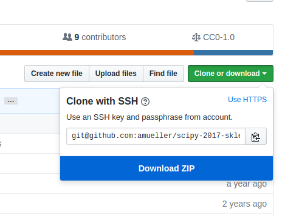
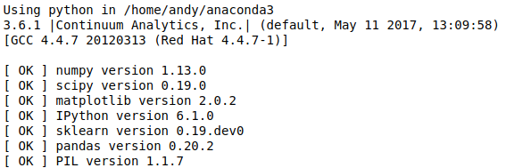

SciPy 2018 Scikit-learn Tutorial
================================


Instructors
-----------

- [Guillaume Lemaitre](https://glemaitre.github.io/)  [@glemaitre](https://github.com/glemaitre) - Inria, Université Paris-Saclay
- [Andreas Mueller](http://amueller.github.io) [@amuellerml](https://twitter.com/amuellerml) - Columbia University; [Book: Introduction to Machine Learning with Python](http://shop.oreilly.com/product/0636920030515.do)
- Mojdeh Rastgoo [@mrastgoo](https://github.com/mrastgoo) - Saint-Gobain Recherche

---

This repository will contain the teaching material and other info associated
with our python introduction and scikit-learn tutorial at the summer school
held from August 1-4 in University of Guadanarama and August 6-9 in Petronas
University.

The repository will be divided into the following subsections:

* `00_python` gives a general introduction to the Python programming language.
* `01_numpy` and `02_pandas` give a general introduction to numerical data
  processing using `numpy` and `pandas`.
* `03_sklearn` contains an in-depth scikit-learn tutorial.


Obtaining the Tutorial Material
--------------------------------


If you have a GitHub account, it is probably most convenient if you clone or
fork the GitHub repository. You can clone the repository by running:

```bash
git clone https://github.com/glemaitre/summer_school_2018.git
```

If you are not familiar with git or don’t have an
GitHub account, you can download the repository as a .zip file by heading over
to the GitHub repository (https://github.com/glemaitre/summer_school_2018) in
your browser and click the green “Download” button in the upper right.



Please note that we may add and improve the material until shortly before the
tutorial session, and we recommend you to update your copy of the materials one
day before the tutorials. If you have an GitHub account and cloned the
repository via GitHub, you can sync your existing local repository with:

```bash
git pull origin master
```

If you don’t have a GitHub account, you may have to re-download the .zip
archive from GitHub.


Installation Notes
------------------

This tutorial will require recent installations of

- [NumPy](http://www.numpy.org)
- [SciPy](http://www.scipy.org)
- [matplotlib](http://matplotlib.org)
- [pandas](http://pandas.pydata.org)
- [pillow](https://python-pillow.org)
- [scikit-learn](http://scikit-learn.org/stable/)
- [IPython](http://ipython.readthedocs.org/en/stable/)
- [Jupyter Notebook](http://jupyter.org)


The last one is important and you should be able to type:

    jupyter notebook

in your terminal window and see the notebook panel load in your web browser.
Try opening and running a notebook from the material to see check that it works. Alternatively you can use Jupyter lab.

For users who do not yet have the required packages installed, a relatively
painless way to install all the requirements is to use a Python distribution
such as [Anaconda](https://www.anaconda.com/download/ "Anaconda"), which includes
the most relevant Python packages for science, math, engineering, and
data analysis; Anaconda can be downloaded and installed for free
including commercial use and redistribution.
The code examples in this tutorial should be compatible to Python 2.7,
Python 3.4-3.6.

After obtaining the material, we **strongly recommend** you to open and execute
the Jupyter Notebook `jupter notebook check_env.ipynb` that is located at the
top level of this repository. Inside the repository, you can open the notebook
by executing

```bash
jupyter notebook check_env.ipynb
```

inside this repository. Inside the Notebook, you can run the code cell by
clicking on the "Run Cells" button as illustrated in the figure below:


Finally, if your environment satisfies the requirements for the tutorials, the
executed code cell will produce an output message as shown below:



Although not required, we also recommend you to update the scikit-learn the latest release version to ensure best compatibility with the teaching material. Please upgrade already installed packages by executing

- `pip install --no-deps --upgrade [package-name]`  
- or `conda update [package-name]`

Depending on how you installed ``scikit-learn``.


Data Downloads
--------------

The data for this tutorial is not included in the repository.  We will be
using several data sets during the tutorial: most are built-in to
scikit-learn, which
includes code that automatically downloads and caches these
data.

**Because the wireless network
at conferences can often be spotty, it would be a good idea to download these
data sets before arriving at the conference.
Please run**
```bash
python fetch_data.py
```
**to download all necessary data beforehand.**

The download size of the data files are approx. 280 MB, and after `fetch_data.py`
extracted the data on your disk, the ./notebook/dataset folder will take 480 MB
of your local hard drive.


Outline
=======

Introduction to Python
----------------------

- Introduction to Python programming language [[view](00_python/0_python.ipynb)]
- Introduction to NumPy (numerical data package) [[view](01_numpy/notebook.ipynb)]
- Introduction to Pandas (tabular data package) [[view](02_pandas/notebook.ipynb)]

Scikit-learn tutorial
---------------------

The full list of the tutorials is:

- 01 Introduction to machine learning with sample applications, Supervised and Unsupervised learning [[view](03_sklearn/notebooks/01.Introduction_to_Machine_Learning.ipynb)]
- 02 Scientific Computing Tools for Python: NumPy, SciPy, and matplotlib [[view](03_sklearn/notebooks/02.Scientific_Computing_Tools_in_Python.ipynb)]
- 03 Data formats, preparation, and representation [[view](03_sklearn/notebooks/03.Data_Representation_for_Machine_Learning.ipynb)]
- 04 Supervised learning: Training and test data [[view](03_sklearn/notebooks/04.Training_and_Testing_Data.ipynb)]
- 05 Supervised learning: Estimators for classification [[view](03_sklearn/notebooks/05.Supervised_Learning-Classification.ipynb)]
- 06 Supervised learning: Estimators for regression analysis [[view](03_sklearn/notebooks/06.Supervised_Learning-Regression.ipynb)]
- 07 Unsupervised learning: Unsupervised Transformers [[view](03_sklearn/notebooks/07.Unsupervised_Learning-Transformations_and_Dimensionality_Reduction.ipynb)]
- 08 Unsupervised learning: Clustering [[view](03_sklearn/notebooks/08.Unsupervised_Learning-Clustering.ipynb)]
- 09 The scikit-learn estimator interface [[view](03_sklearn/notebooks/09.Review_of_Scikit-learn_API.ipynb)]
- 10 Preparing a real-world dataset (titanic) [[view](03_sklearn/notebooks/10.Case_Study-Titanic_Survival.ipynb)]
- 11 Working with text data via the bag-of-words model [[view](03_sklearn/notebooks/11.Text_Feature_Extraction.ipynb)]
- 12 Application: IMDb Movie Review Sentiment Analysis [[view](03_sklearn/notebooks/12.Case_Study-SMS_Spam_Detection.ipynb)]
- 13 Cross-Validation [[view](03_sklearn/notebooks/13.Cross_Validation.ipynb)]
- 14 Model complexity and grid search for adjusting hyperparameters [[view](03_sklearn/notebooks/14.Model_Complexity_and_GridSearchCV.ipynb)]
- 15 Scikit-learn Pipelines [[view](03_sklearn/notebooks/15.Pipelining_Estimators.ipynb)]
- 16 Supervised learning: Performance metrics for classification [[view](03_sklearn/notebooks/16.Performance_metrics_and_Model_Evaluation.ipynb)]
- 17 Supervised learning: Linear Models [[view](03_sklearn/notebooks/17.In_Depth-Linear_Models.ipynb)]
- 18 Supervised learning: Decision trees and random forests, and ensemble methods [[view](03_sklearn/notebooks/18.In_Depth-Trees_and_Forests.ipynb)]
- 19 Supervised learning: feature selection [[view](03_sklearn/notebooks/19.Feature_Selection.ipynb)]
- 20 Unsupervised learning: Hierarchical and density-based clustering algorithms [[view](03_sklearn/notebooks/20.Unsupervised_learning-Hierarchical_and_density-based_clustering_algorithms.ipynb)]
- 21 Unsupervised learning: Non-linear dimensionality reduction [[view](03_sklearn/notebooks/21.Unsupervised_learning-Non-linear_dimensionality_reduction.ipynb)]
- 22 Unsupervised learning: Anomaly Detection [[view](03_sklearn/notebooks/22.Unsupervised_learning-anomaly_detection.ipynb)]
- 23 Supervised learning: Out-of-core learning [[view](03_sklearn/notebooks/23.Out-of-core_Learning_Large_Scale_Text_Classification.ipynb)]

For time constraint, we will most probably focus on the following list of tutorials: [01, 02, 03, 04, 05, 06, 07, 08, 09, 10, 13, 14, 15, 17, 18, 19]. If time allows, we will cover the notebooks which are note specified.
